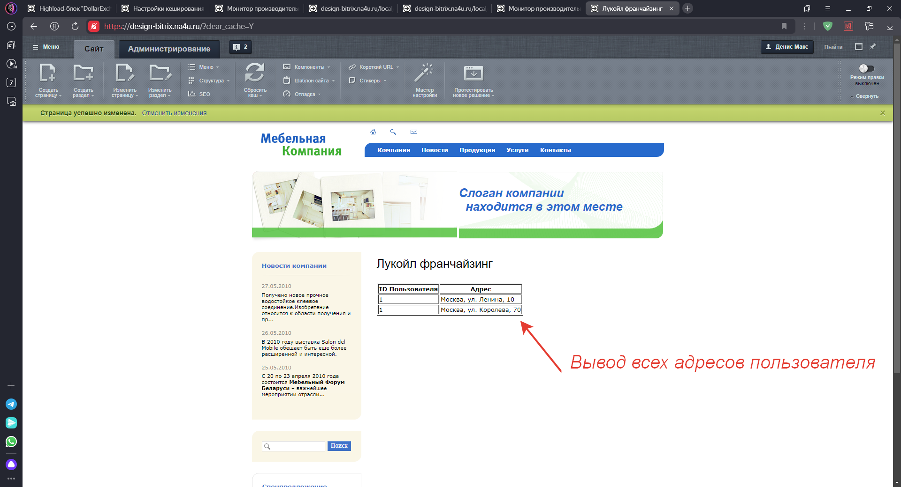

# Bitrix-List-of-addresses
Список адресов текущего авторизованного пользователя для "Битрикс управление сайтом"

Моудуль chamomile.astra устанавливает на сайт компонент который осуществляет вывод адресов текущего пользователя из highload блока.  
У компонента есть 1 параметр: выводить все адреса или только активные.  
Для вывода таблицы используется bitrix:main.ui.grid.  
Используется class.php и d7 api.  
Реализован кеш компонента, при изменении данных в highload блоке сбрасывается кеш (по событию). Использован тегированный кеш для того чтобы отлавливать событие изменения highload блока и сбрасывать кеш по тегу  


Установка:      
Установить как обычный модуль битрик управление сайтом в разделе  
"Ваш сайт/bitrix/admin/partner_modules.php?lang=ru"  


Подключение:  
```php
<?
/* Подключит лист адресов*/
$APPLICATION->IncludeComponent(
    "chamomile:list.addresses",
    "",
    array(),
    false
);
?>
```

Скриншоты 

    
 
 
 
 
 

